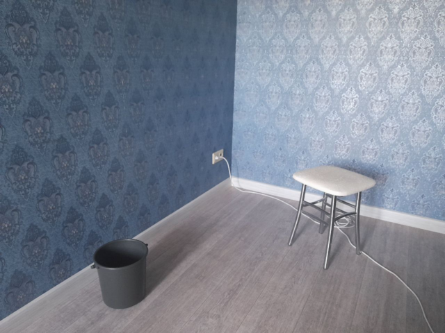
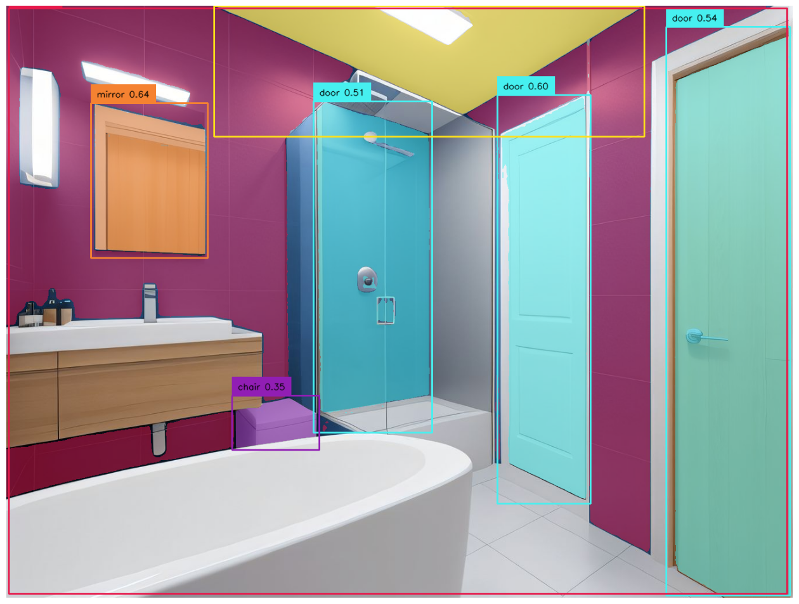
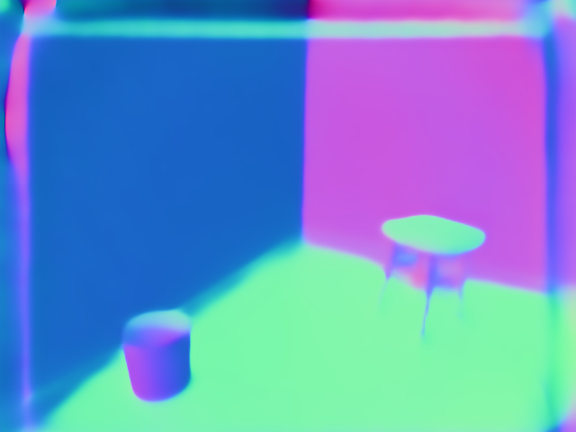
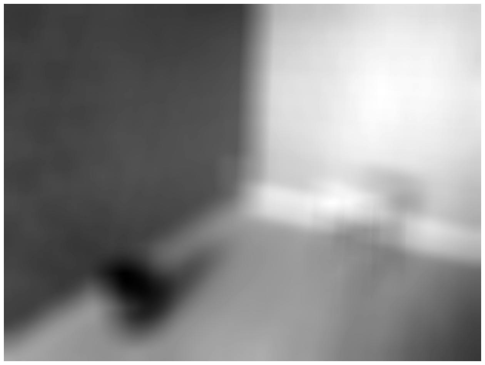
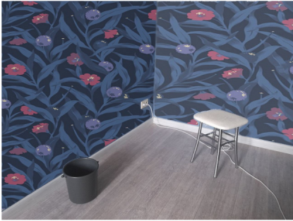

# DecorWardrobeProject

Этот проект для людей, которые хотели бы подобрать дизайн своей квартиры просто и быстро,
не обращаясь за помощью к профессионалу.

В данный момент реализован функционал: 
  * Детекции и сегментации стен
  * Извлечения карты нормалей изображения.

За детекцию и сегментацию отвечает segmentation_v01.ipynb, он работает как на искусственно созданных,
так и на реальных изображениях:

### Исходник

### Сегментация

### Сгенерированное изображение (быть может кто-то подбирает новый дизайн с нуля и скачал изображение)

За извлечение карт нормалей отвечает eval.py и прочие .py файлы(библеотеки и модули):

### Исходник

### Карта нормалей

### Проекция

Для начала нужно извлечь относительную освещенность, для этого переведем картинку в grayscale и пройдемся
mean blur:

Затем повернем нормаль обоев (пологая ее (0,0,1)) на нормали стен и добавим относительную освещенность:

## Credit is due

Нейронная сеть по извлечению карт нормалей была позаимствована у

https://github.com/baegwangbin/surface_normal_uncertainty

@InProceedings{Bae2021,
    title   = {Estimating and Exploiting the Aleatoric Uncertainty in Surface Normal Estimation}
    author  = {Gwangbin Bae and Ignas Budvytis and Roberto Cipolla},
    booktitle = {International Conference on Computer Vision (ICCV)},
    year = {2021}                         
}

